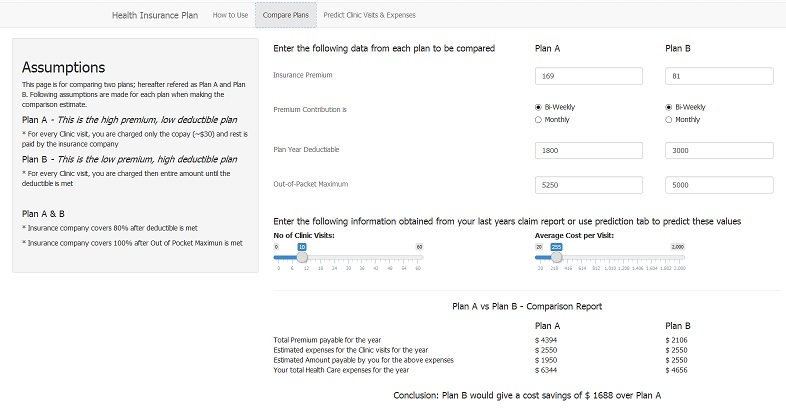
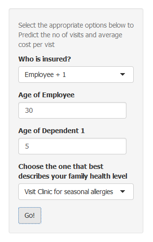

Developing Data Products Project - Health Insurance Plan Analysis
========================================================
author: Easwer Chinnadurai
date: 2/22/2015
transition: rotate

Health Insurance Plan Analysis
========================================================

Disclaimer:
This presentation was created as part of the "Developing Data Products" course on the Data Science Specialization of the Johns Hopkins University of Public Health. 

The designed prediction model and averages were obtained with a very limited amount of health insurance related 
data that I obtained from my colleges. Also I had not considered every influencing variable/factors. The health care need for everyone is unique. So use this data, model and prediction output at your own discretion.

The Application
========================================================

To display the understanding of using shiny to build an application, a simple application to analyse the total cost different Health Insurance plan has been developed and deployed at: https://easwerc.shinyapps.io/HealthInsurancePlan/

<small>Most employers provide health insurance for their employees. The insurance plan offered comes with multiple type of plans. Usually one with high premium but low deductible and at least one other with low premium but with high deductible. Employees need to choose one of these plan. They are left with the question, Which plan is best for me?

This application helps the user calculate the total cost for the health insurance by providing some information from his/hers past year data. If past years data is not available then the app helps predict those information by providing some basic details </small>

Compare Plans
========================================================

<small>Provide the basic details from each plan. You can also analyze the change in total expense by changing the influencing factors</small>

Predict Cost & Visits
========================================================

<small>When the users does not have his/hers year's claims data. Then the app helps predict it by getting some basic information</small>

***

 

Summary
========================================================
transition:rotate

* This application helps compare two Health Plans
* Estimates the total health care expense for a Year
* Helps predict the number of clinical visits and cost
* Provides good information to help the user decide on which type of plan to choose.

